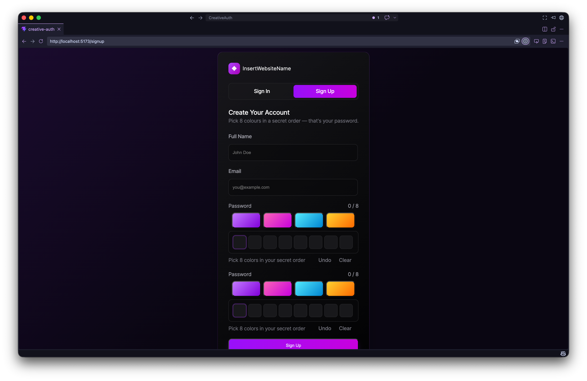
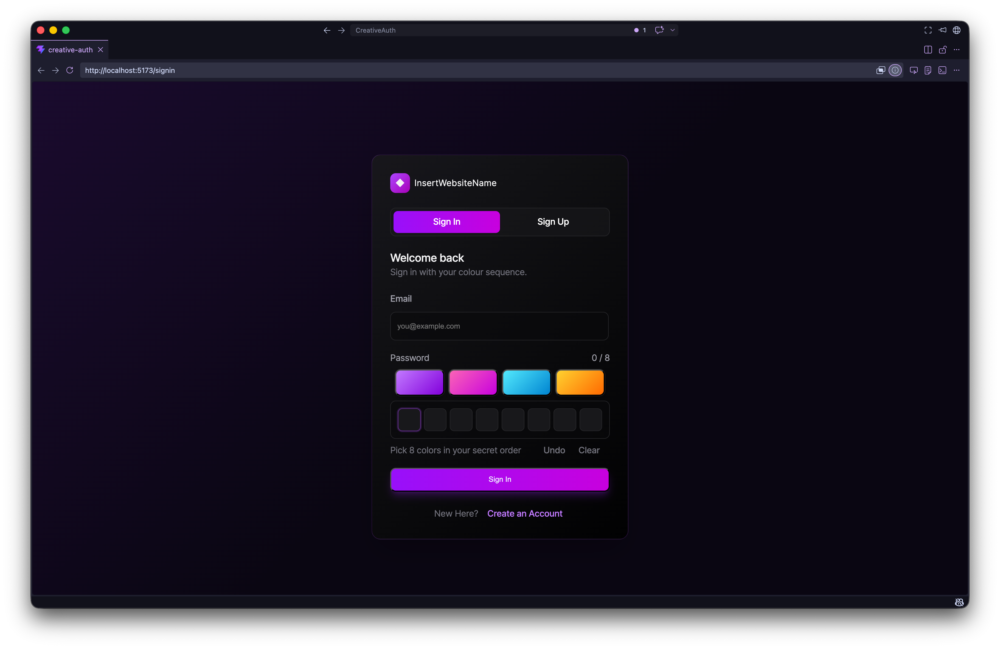
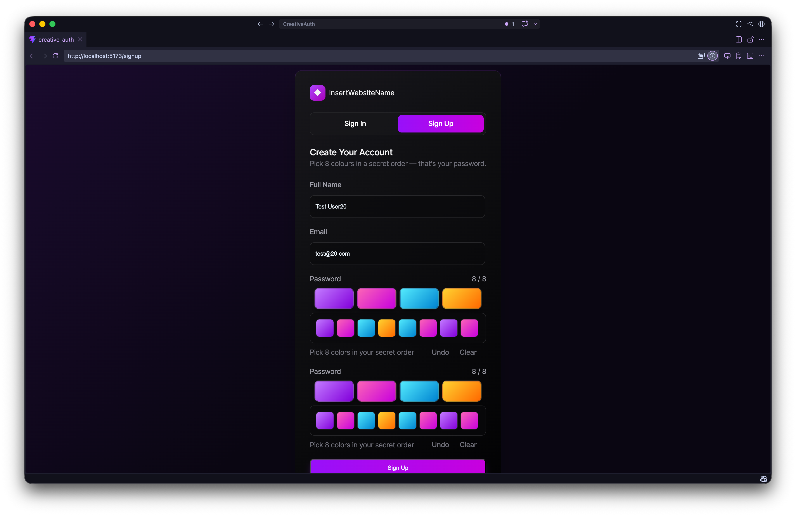
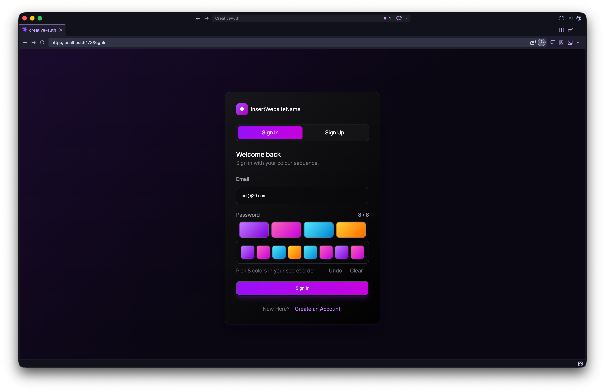
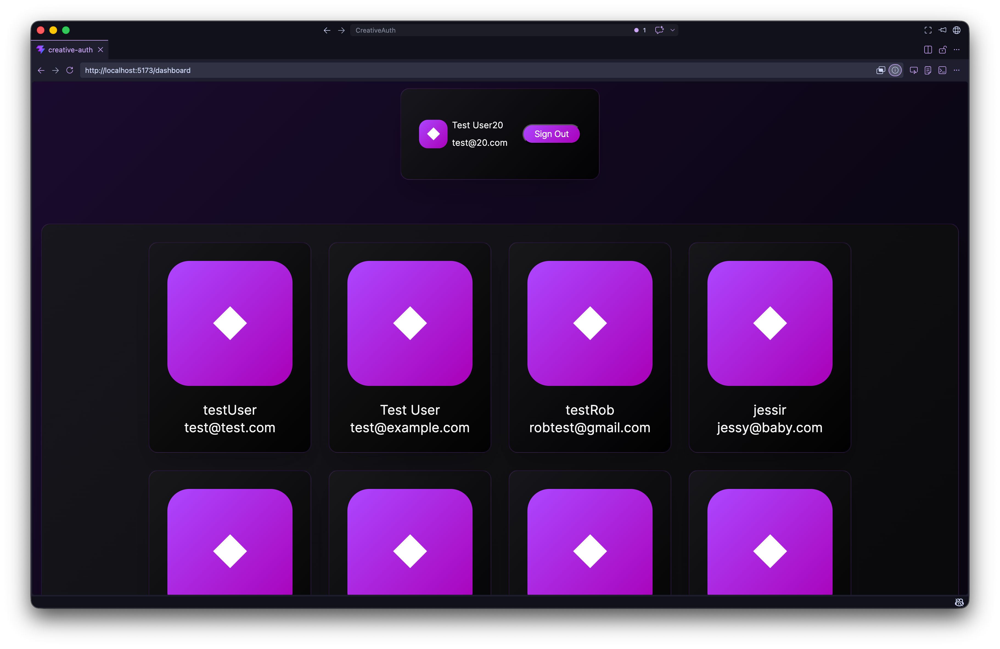

# CreativeAuth
 
A full-stack MERN (MongoDB, Express, React, Node.js) authentication application that replaces traditional text-based passwords with a unique colour sequence picker. Users register and sign in by selecting a sequence of colours, providing a more visual and creative approach to authentication.
 
---
 
## Project Overview
 
CreativeAuth is a MERN stack web application developed as part of a full-stack development tutorial. The project demonstrates core concepts in RESTful API design, React component architecture, MongoDB data persistence, and client-server communication via Axios.
 
Rather than a conventional password field, users interact with a custom `PasswordPicker` component that records a sequence of colour selections. This sequence is stored as a string and, after being encrypted, used for both registration and authentication. As an added personal challenge, this project also aims to complete the full CRUD cycle, allowing users to create an account, read existing accounts, update a signed-in account, and delete other accounts (Note: this was not possible, unfortunately; however, I will add it as soon as possible...).

---

## Screenshots







---

## Demo Video

### Google Doc Link to Video:

video link here

---
 
## Table of Contents
 
- [Project Overview](#project-overview)
- [Features](#features)
- [Tech Stack](#tech-stack)
- [Setup & Installation](#setup--installation)
- [API Endpoints](#api-endpoints)
- [Project Structure](#project-structure)
- [License](#license)

---
 
## Features
 
- User registration with name, email, and colour sequence password
- User login with email and colour sequence verification
- Colour sequence password picker component
- Password confirmation validation on registration
- Persistent login session via `localStorage`
- Dashboard displaying the logged-in user's details
- Dashboard listing all registered users fetched from the database
- RESTful backend API built with Express.js
- MongoDB database integration via Mongoose
- Environment variable configuration via `.env`
- CORS-enabled API for local development
---
 
## Tech Stack

[](https://www.mongodb.com)
[](https://expressjs.com)
[](https://react.dev/)
[](https://nodejs.org/en)
[](https://www.javascript.com/)
 
| Frontend |  | Backend |  |
|---|---|---|---|
| Technology | Purpose | Technology | Purpose |
| React 18 | UI framework | Node.js | Runtime environment |
| Vite | Build tool and dev server | Express.js | Web framework and routing |
| React Router DOM | Client-side routing | MongoDB | NoSQL database |
| Axios | HTTP requests to the backend API | Mongoose | MongoDB object modelling |
|  |  | dotenv | Environment variable management |
|  |  | CORS | Cross-origin resource sharing |
|  |  | Nodemon | Development auto-restart |
 
---

## User Flow Diagram



---
 
## Setup & Installation
 
### Prerequisites
 
Ensure the following are installed on your machine:
 
- [Node.js](https://nodejs.org/) (v18 or higher)
- [MongoDB](https://www.mongodb.com/) (local or [MongoDB Atlas](https://www.mongodb.com/atlas))
- [Git](https://git-scm.com/)
### 1. Clone the Repository
 
```bash
git clone https://github.com/your-username/creativeauth.git
cd creativeauth
```
 
### 2. Install Backend Dependencies
 
```bash
cd server
npm install
```
 
### 3. Configure Environment Variables
 
Create a `.env` file in the `/server` directory:
 
```env
MONGO_URI=your_mongodb_connection_string
PORT=5001
```
 
### 4. Start the Backend Server
 
```bash
npm run dev
```
 
The server will run on `http://localhost:5001`
 
### 5. Install Frontend Dependencies
 
Open a new terminal window:
 
```bash
cd client
npm install
```
 
### 6. Start the Frontend
 
```bash
npm run dev
```
 
The React app will run on `http://localhost:5173`
 
---
 
## API Endpoints
 
Base URL: `http://localhost:5001`
 
| Method | Endpoint | Description | Request Body |
|---|---|---|---|
| `POST` | `/auth/register` | Register a new user | `{ name, email, password }` |
| `POST` | `/auth/login` | Log in an existing user | `{ email, password }` |
| `GET` | `/auth/allUsers` | Retrieve all registered users | None |
 
### Example Request — Register
 
```json
POST /auth/register
{
  "name": "John Doe",
  "email": "john@example.com",
  "password": "redbluegreenyellow"
}
```
 
### Example Response — Login
 
```json
{
  "message": "Login successful",
  "user": {
    "_id": "664abc123...",
    "name": "John Doe",
    "email": "john@example.com"
  }
}
```

## Planned Features

The current implementation covers the **Create** and **Read** aspects of CRUD functionality. The following features are planned for future development to complete the full CRUD cycle:

| Feature | CRUD Operation | Description |
|---|---|---|
| Edit User | **Update** | Allow logged-in users to update their name, email, and colour sequence password via a dedicated edit profile page |
| Delete User | **Delete** | Allow logged-in users to permanently delete their account from the database |

These features will require the following additional API endpoints:

| Method | Endpoint | Description |
|---|---|---|
| `PUT` | `/auth/update/:id` | Update a user's details by ID |
| `DELETE` | `/auth/delete/:id` | Delete a user account by ID |
 
---
 
## Project Structure
 
```
creativeauth/
├── client/                   # React + Vite frontend
│   ├── src/
│   │   ├── api.js            # Axios API functions
│   │   ├── components/       # Reusable UI components
│   │   │   ├── UserComponent.jsx
│   │   │   ├── UsersComponent.jsx
│   │   │   ├── PasswordPicker.jsx
│   │   │   └── LogInSignUpToggle.jsx
│   │   ├── pages/            # Page-level components
│   │   │   ├── SignIn.jsx
│   │   │   ├── SignUp.jsx
│   │   │   └── Dashboard.jsx
│   │   └── main.jsx
│   └── package.json
│
├── server/                   # Node.js + Express backend
│   ├── models/
│   │   └── User.js           # Mongoose User schema
│   ├── routes/
│   │   ├── auth.js           # Authentication routes
│   │   └── userRoutes.js     # User routes
│   ├── server.js             # Express app entry point
│   ├── .env                  # Environment variables (not committed)
│   └── package.json
│
└── README.md
```
 
---
 
## License
 
This project is licensed under the [MIT License](https://opensource.org/licenses/MIT).
 
You are free to use, modify, and distribute this project for personal or educational purposes with attribution.
 
---
 
*Developed as part of a MERN stack development tutorial — Open Window, DV200, Term 2.*
